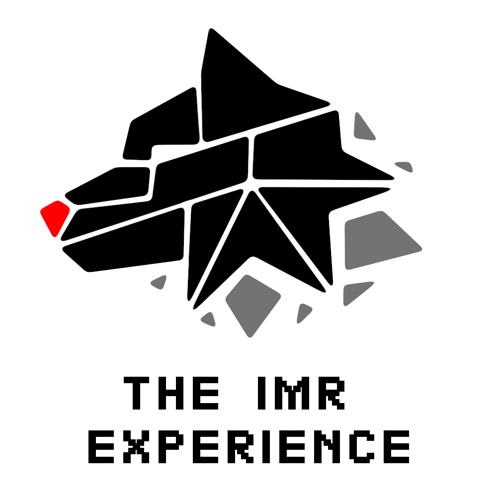

# THE IMR EXPERIENCE (NFTHACK2022)

Creating an immersive NFT mixed reality experience from shopping to showcasing the NFT artwork you own from your home and in the metaverse.

With demos and approaches to interlinking NFTs and enabling the ability to generate AR NFTs from flat images and Link existing AR NFTs to flat NFTs. 

# Snapchat OpenSea Lens
Install our Snapchat OpenSea lens and point it at the Opensea NFT Library to view NFTs in augmented reality that we have hooked up! 
https://github.com/JohnRSim/Snapchat-OpenSea-Lens  

# Enhancing OpenSea
## Social share Twitter AR Player support
Enables users to share OpenSea NFT page to Twitter and display the interactive 3D NFT Assets 
Currently OpenSea only shows a static image of 3D content with the cards in Twitter.  
https://github.com/JohnRSim/Twitter-Card-NFT-Generator 
## Launch AR experience from mobile and drop in home
Enables users with a click of a button direct from OpenSea to load in a 3D AR asset from their mobile and experience it in AR wherever they are.
https://github.com/JohnRSim/Launching-Web-AR-experiences

# 3D NFT Generator
Convert your Flat NFT artwork into 3D GLB assets that you can place in your home or bring to the metaverse. 
https://nfthack2022.netlify.app/convert

# MetaQuest - Metaverse NFT Wallet access.
PWA App available from the appstore connected with the NFT Bridge to access and download your AR/3D assets and display them in the metaverse in your Virtual home. 
https://github.com/JohnRSim/Metaverse-NFT-Interlinked-Wallet

# Tech
Netlify/Sveltkit/OpenSea/Moralis/SnapChat lens/Solidity/PWA.
